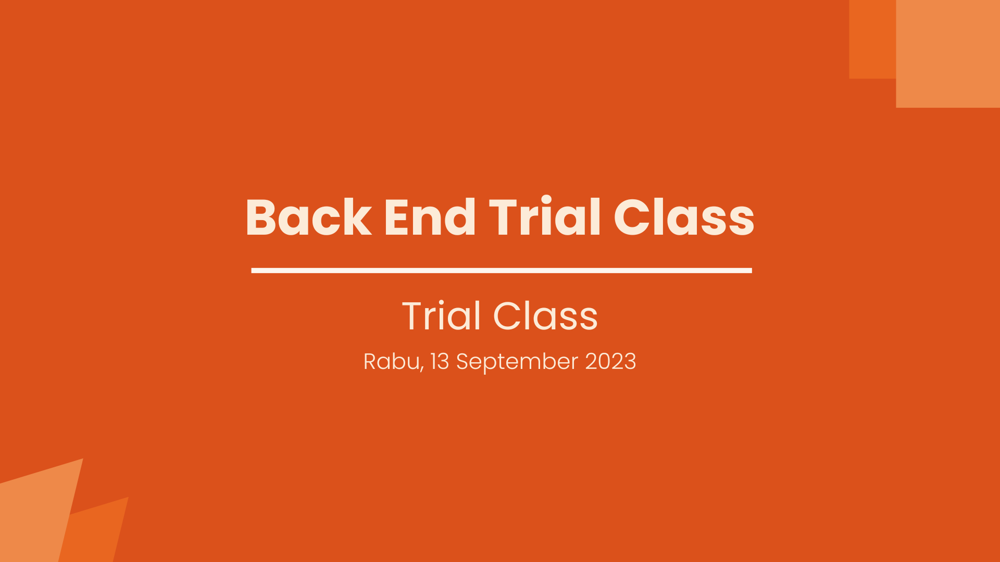

    

    

        <h1>LnT Trial Class Back End Development</h1>
        

            Back End adalah bagian dari web yang <b>tidak dilihat oleh user</b>. Contoh Back End adalah pengolahan database (CRUD), authentication & authorization, session & cookie, dll.
             
             
            Back End berbeda dengan Front End. Front End mengatur segala tampilan yang dilihat oleh user. Back End mengatur apa yang tidak dilihat user.
             
             
            Back End punya peran penting dalam sebuah website, karena jika tidak ada back end, data website kamu akan menjadi <b>statis</b>.
        

        <h2>Bahasa Pemograman</h2>
        <ul>
            <li>PHP </li>
            <li>Python</li>
            <li>Javascript</li>
            <li>Ruby</li>
            <li>Java</li>
        </ul>
        <h2>Roadmap Journey</h2>
        <ul>
            <li>HTML, CSS, dan JS (bootstrap & JQuery)</li>
            <li>PHP Basic and Web (Session & Cookie)</li>
            <li>DBMS (Database Management System)</li>
            <li>Laravel (MVC Concept)</li>
            <li>Poject (Mid and Final)</li>
        </ul>
             <h2>To Do</h2>
        

            <input type="checkbox">
            <label>Connect to DB</label>
        

        

            <input type="checkbox">
            <label>CRUD</label>
        

        

            <input type="checkbox">
            <label>Search Item</label>
        

        

            
!!! Note

            

                <ul style="background-color:#966512; color:white; padding-top:15px; padding-bottom:15px; box-shadow: 3px 3px 10px black;;">
                    <li>
                        Lesson Plan Menyusul ya :D
                    </li>
                    <li>
                        Kita akan coba to do trial class
                    </li>
                </ul>
            

        

    

